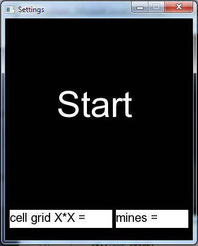
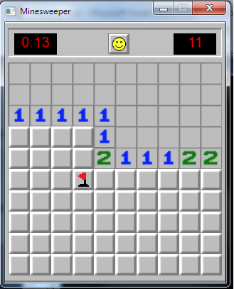
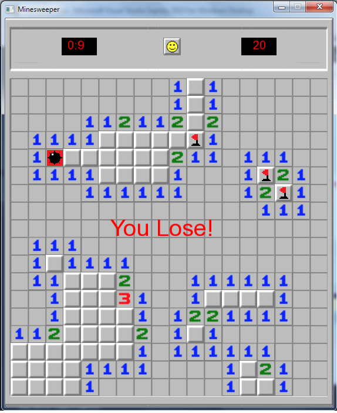

# Minesweeper

# How to play
When you move the mouse over one of the text boxes "cell grid X*X" or "mines" it will change it's color and you will be able\
to write in them. With left click on the "start" the "settings" window will be closed and "Minesweeper" window will be open. 

 

With left click on a cell you can open the cell and with right click you can placed a flag on it. When the number of unopened 
cells is equal to the number of mines you win the game. On the other hand, if you open a mine the game is over. If you left 
click on the "smiled face" you can restart the game with current settings. And when you close the "Minesweeper"window the 
"settings" window will be open.

# Requirements

To compile the program you will need SFML-2.4.2.
